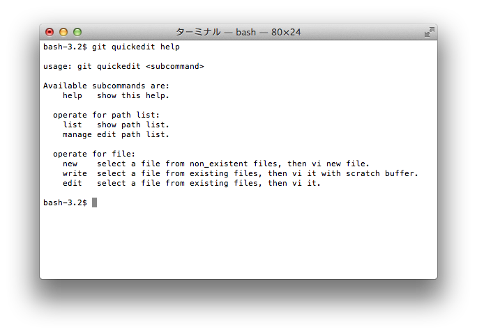
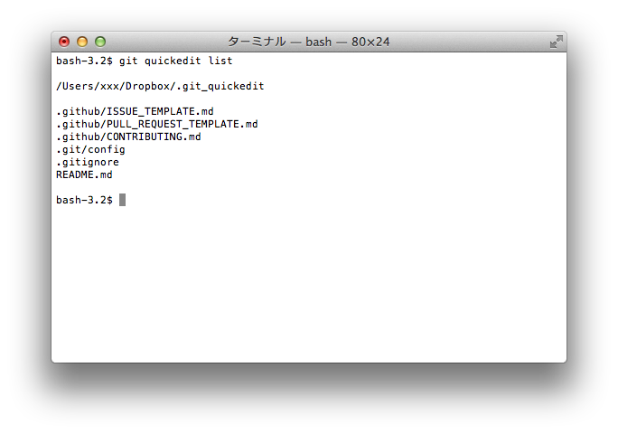
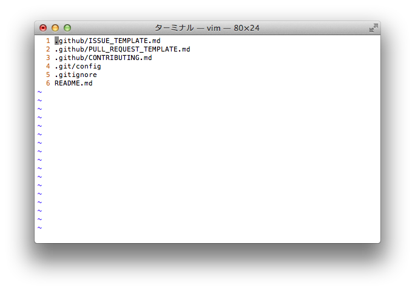
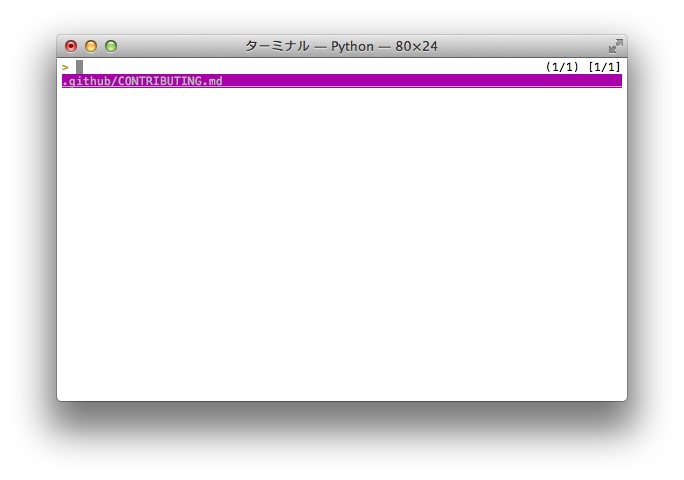
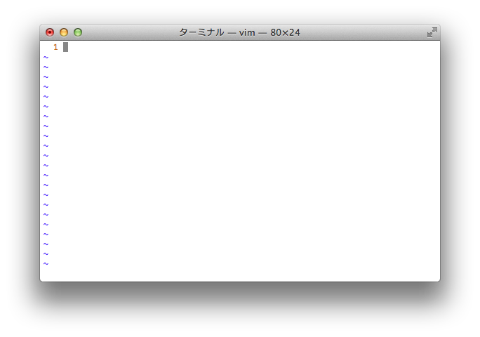
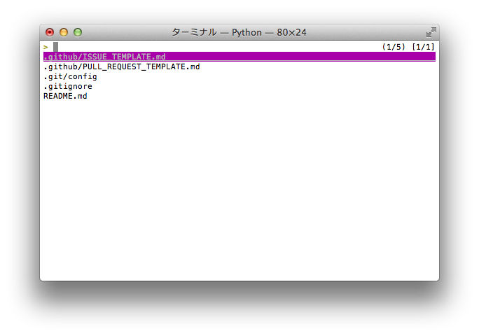
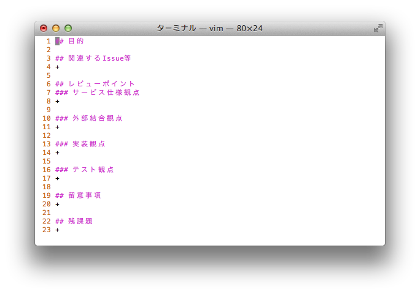
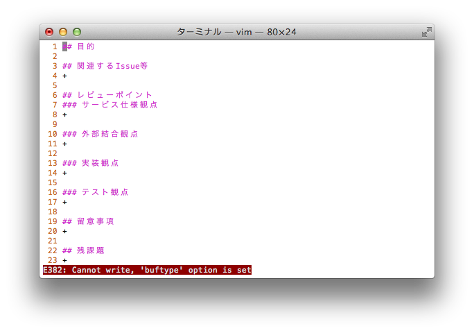

# git-quickedit
よく使うファイルをすぐ編集できるGitプラグイン

## 概要
git管理下でよく編集するファイルをリストアップしておき、そのリストを[`percol`](https://github.com/mooz/percol)で絞り込みサクっと編集する
git管理下であればどこで実行しても正しいファイルパスで編集できる

## 動作環境
pythonは2.7で動作を確認した
3系での動作は未確認

## インストール
### git-quickedit
```
wget 'https://raw.githubusercontent.com/suzuki-hoge/dev-note/master/git-quickedit/git-quickedit'
```

上記の方法等で取得したファイルをパスの通った場所に置いてください
`git-xxx`という実行ファイルをパスの通った場所に置くと、`git xxx`で実行できます

### percol
```
sudo pip install percol
```

pipを用いない方法は[公式](https://github.com/mooz/percol#installation)を参照してください

## パスリスト
よく使うファイル名をテキストで管理します

### パス
特に明記が無い場合は`~/.git_quickedit`と言うファイルを用います

リポジトリ毎に変更したい場合は以下の様に`.git/config`に追記してください

```
git config quickedit.pathlist /Users/xxx/project-xxx/Dropbox/.git_quickedit
```

リポジトリ毎ではなくグローバルなパスリストを設定する場合は以下の様に`~/.gitconfig`に追記してください

```
git config --global quickedit.pathlist /Users/xxx/Dropbox/.git_quickedit
```

パスリスト検索は以下の順で行われます

1. リポジトリ固有の`.git/config`の設定場所
+ グローバルの`~/.gitconfig`の設定場所
+ `~/.git_quickedit`

また、指定されたパスに実ファイルが見つからなかった場合は新規作成を促すガイドが表示されます

### 内容例
```
.github/ISSUE_TEMPLATE.md
.github/PULL_REQUEST_TEMPLATE.md
.github/CONTRIBUTING.md
.git/config
.gitignore
README.md
```

僕はgithubのルールに則ったテンプレートファイルや良く触るファイルを定義しました
他には`.git/hooks/pre-push`なんてフックスクリプトとかを列挙しておいても良いかもしれません

## コマンド
### git template help
ヘルプを表示する



### git template list
パスリストの参照をする



### git template manage
パスリストの編集をする



### git template new
リストの中の**実在しないパスのみ**を`percol`で選択し、`vim`で編集する




### git template write
リストの中の**実在するパスのみ**を`percol`で選択し、`vim`の無名バッファで編集する
`write`は実在するファイルを開き編集するが、保存することは出来ない





### git template edit
リストの中の**実在するパスのみ**を`percol`で選択し、`vim`で編集する

保存可能な点以外は`write`と同じ
